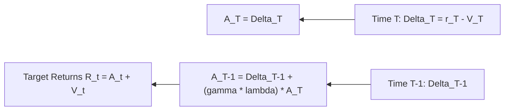

# genpark-generalized-advantage-estimation-gae-skill

Generalized Advantage Estimation (GAE) engine calculating bias-variance balanced TD advantage estimates.

## Architecture

## Features
- **Configurable Gamma and Lambda**: Balance sample efficiency and bias.
- **Zero Dependencies**: 100% Python Standard Library.
